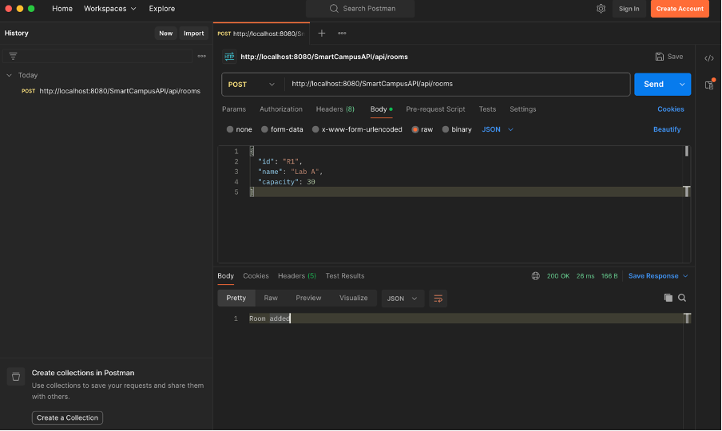
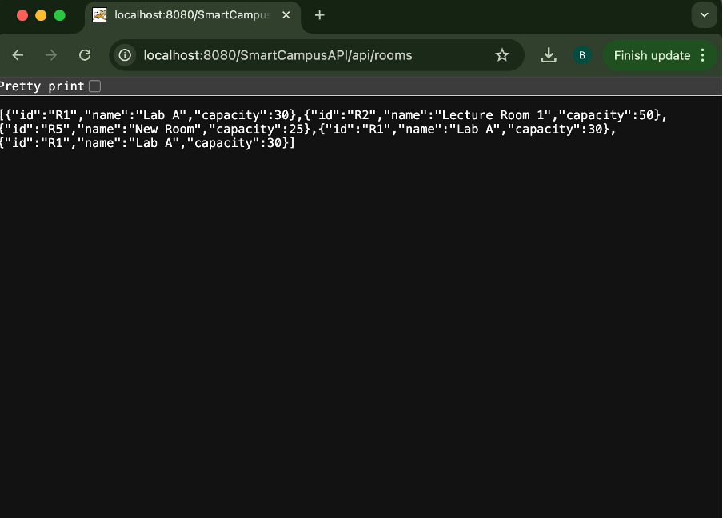
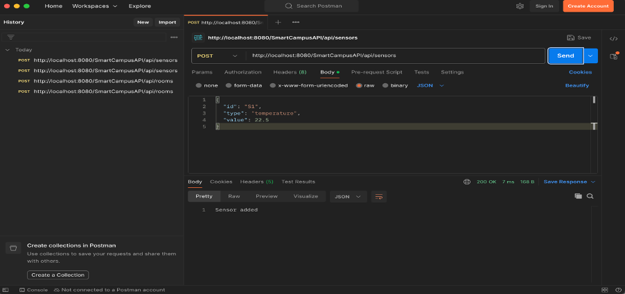
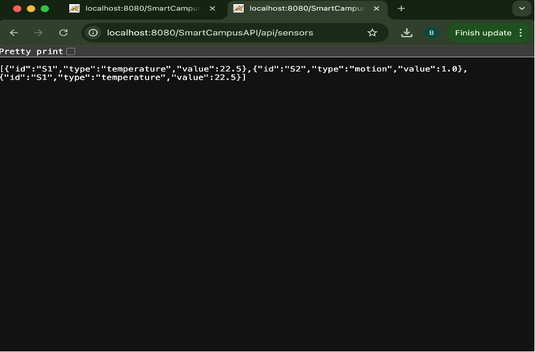

# SmartCampusAPI

## Overview

This project is a RESTful API developed using Java and JAX-RS.
It simulates a Smart Campus system where rooms and sensors can be managed.

The API allows users to create and retrieve information about rooms and sensors.

---

## Technologies Used

* Java
* JAX-RS (Jersey)
* Maven
* Apache Tomcat / GlassFish
* Postman (for testing)

---

## Project Structure

* **model** → Contains data classes (Room, Sensor)
* **resource** → Contains REST endpoints (RoomResource, SensorResource)
* **config** → JAX-RS configuration

---

## API Endpoints

### Rooms

#### GET /api/rooms

Returns all rooms

Example response:

```json
[
  {"id":"R1","name":"Lab A","capacity":30},
  {"id":"R2","name":"Lecture Room 1","capacity":50}
]
```

#### POST /api/rooms

Adds a new room

Example request:

```json
{
  "id": "R3",
  "name": "Library",
  "capacity": 100
}
```

---

### Sensors

#### GET /api/sensors

Returns all sensors

Example response:

```json
[
  {"id":"S1","type":"temperature","value":22.5},
  {"id":"S2","type":"humidity","value":60}
]
```

#### POST /api/sensors

Adds a new sensor

Example request:

```json
{
  "id": "S3",
  "type": "pressure",
  "value": 101.3
}
```

---

## Testing

The API was tested using Postman.

* All endpoints were tested successfully
* GET requests returned correct data
* POST requests added new data correctly

---

## Screenshots

### Add Room (POST)


### Get Rooms (GET)


### Add Sensor (POST)


### Get Sensors (GET)


---

## Video Demonstration

(Add your video link here)

Example:
https://your-video-link-here

---

## Conclusion

This project demonstrates a REST API using JAX-RS.

It successfully manages rooms and sensors using GET and POST operations and shows how a Smart Campus system can be implemented.
